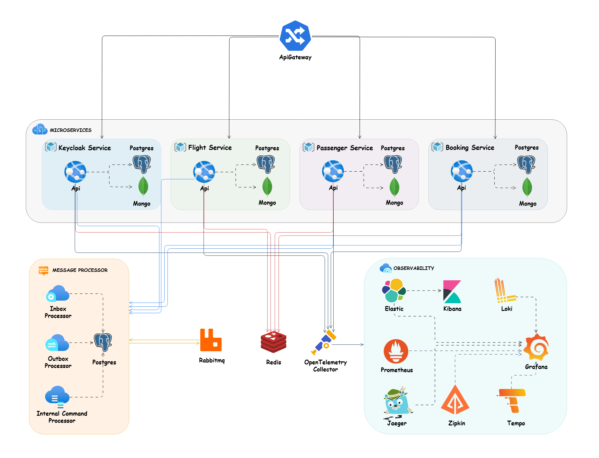
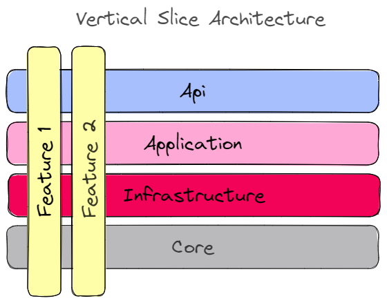

<div align="center" style="margin-bottom:20px">
  
</div>

> 🚀 **A personal Java Spring Boot microservices project for booking workflows, built around Vertical Slice Architecture, Event Driven Architecture, CQRS, DDD, gRPC, MongoDB, and RabbitMQ.**

**This repository is maintained as my personal version of the booking platform.**

## Key Achievements

- **Distributed Microservices Architecture**: Built a Java Spring Boot microservices booking platform with 4 independent distributed services (Flight, Passenger, Booking, API Gateway), implementing CQRS, DDD, and vertical-slice architecture for scalable booking workflows.

- **Resilient Asynchronous Communication**: Implemented inter-service messaging using RabbitMQ with Spring AMQP and gRPC for synchronous calls, leveraging outbox/inbox patterns with automatic retry logic to ensure exactly-once delivery and eliminate synchronous service dependencies.

- **Production-Grade Observability & Testing**: Integrated Keycloak OAuth2/OpenID-Connect authentication, OpenAPI 3.0 documentation, OpenTelemetry collector with Jaeger tracing and Prometheus metrics, plus comprehensive testing infrastructure with unit/integration/E2E tests using Testcontainers (PostgreSQL, MongoDB, RabbitMQ) and Mockito for mocking.

# Table of Contents

- [The Goals of This Project](#the-goals-of-this-project)
- [Plan](#plan)
- [Technologies - Libraries](#technologies---libraries)
- [The Domain and Bounded Context - Service Boundary](#the-domain-and-bounded-context---service-boundary)
- [Structure of Project](#structure-of-project)
- [How to Run](#how-to-run)
  - [Docker Compose](#docker-compose)
  - [Build](#build)
  - [Run](#run)
  - [Test](#test)
- [Documentation Apis](#documentation-apis)
- [Support](#support)
- [Contribution](#contribution)

## The Goals of This Project

- :sparkle: Using `Vertical Slice Architecture` for `architecture` level.
- :sparkle: Using `Spring MVC` as a `Web Framework`.
- :sparkle: Using `Domain Driven Design (DDD)` to implement all `business processes` in microservices.
- :sparkle: Using `Spring AMQP` on top of `Rabbitmq` for `Event Driven Architecture` between our microservices.
- :sparkle: Using `gRPC` for `internal communication` between our microservices.
- :sparkle: Using `CQRS` implementation with `Mediator` library.
- :sparkle: Using `Spring Data JPA` for `data persistence` and `ORM` in `write side` with `Postgres`.
- :sparkle: Using `Spring Data MongoDB` for `data persistence` and `ORM` in `read side` with `MongoDB`.
- :sparkle: Using `Inbox Pattern` for ensuring message idempotency for receiver and `Exactly once Delivery`.
- :sparkle: Using `Outbox Pattern` for ensuring no message is lost and there is at `At Least One Delivery`.
- :sparkle: Using `Unit Testing` for testing small units and mocking our dependencies with `Mockito`.
- :sparkle: Using `End-To-End Testing` and `Integration Testing` for testing `features` with all dependencies using `testcontainers`.
- :sparkle: Using `Spring Validator` and a `Validation Pipeline Behaviour` on top of `Mediator`.
- :sparkle: Using `Springdoc Openapi` for generating `OpenAPI documentation` in Spring Boot.
- :sparkle: Using `OpenTelemetry Collector` for collecting `Metrics`, `Tracings` and `Structured Logs`.
- :sparkle: Using `Kibana` for `Logging` top of `OpenTelemetry Collector`.
- :sparkle: Using `Jaeger` for `Distributed Tracing` top of `OpenTelemetry Collector`.
- :sparkle: Using `Prometheus` and `Grafana` for `monitoring` top of `OpenTelemetry Collector`.
- :sparkle: Using `Keycloak` for `authentication` and `authorization` base on `OpenID-Connect` and `OAuth2`.
- :sparkle: Using `Spring Cloud Gateway` as a microservices `gateway`.


## Plan

> 🌀This project is a work in progress, and I will keep adding new features over time.🌀

I will track future goals and additions in the repository Issues section.

High-level plan is represented in the table

| Feature           | Status         |
|-------------------| -------------- |
| API Gateway       | Completed ✔️   |
| Keycloak Service  | Completed ✔️   |
| Flight Service    | Completed ✔️   |
| Passenger Service | Completed ✔️   |
| Booking Service   | Completed ✔️   |
| Building Blocks   | Completed ✔️   |


## Technologies - Libraries
- ✔️ Spring Boot - Framework for building Java applications with pre-configured defaults and embedded server support.
- ✔️ Spring AMQP - Simplifies messaging using RabbitMQ with declarative configuration and templates.
- ✔️ Spring Data JPA - Enhances JPA with repository abstractions and advanced query capabilities.
- ✔️ Spring Data MongoDB - Provides seamless MongoDB integration with Spring-based applications.
- ✔️ Spring Security - Comprehensive security framework for authentication and authorization in Java applications.
- ✔️ Keycloak - An identity and access management solution supporting OpenID Connect and OAuth 2.0.
- ✔️ PostgreSQL - Official JDBC driver for PostgreSQL, enabling Java applications to interact with PostgreSQL databases.
- ✔️ Springdoc OpenAPI - Automatically generates OpenAPI 3 documentation for Spring Boot projects.
- ✔️ Swagger Core - Core library for building and consuming Swagger-compliant APIs.
- ✔️ OpenTelemetry Collector - Collects, processes, and exports telemetry data (traces, metrics, logs) for observability.
- ✔️ Lombok - Reduces boilerplate code in Java by generating common methods like getters and setters.
- ✔️ Flyway - Database migration tool for version-controlled and repeatable schema changes.
- ✔️ JPA Buddy - Productivity tool for working with JPA and Hibernate, simplifying development and debugging.
- ✔️ UUID Creator - Library for generating UUIDs in various formats and versions.
- ✔️ QueryDSL - Enables type-safe queries for JPA, SQL, and other persistence layers.
- ✔️ Reflections - Facilitates metadata scanning and classpath resource analysis in Java.
- ✔️ gRPC Spring - Integration of gRPC with Spring Boot for building high-performance RPC services.
- ✔️ Testcontainers - Provides lightweight, disposable Docker containers for testing purposes.
- ✔️ Mockito - Popular mocking framework for writing clean, maintainable unit tests in Java.
- ✔️ JUnit - Essential testing framework for Java developers, supporting unit and integration testing.


## The Domain And Bounded Context - Service Boundary

- `Keycloak Service`: The Keycloak Service is an identity provider for the authentication and authorization of users using Keycloak. This service is responsible for creating new users and their corresponding role permissions and handling authentication and authorization with OpenID Connect and OAuth2.

- `Flight Service`: The Flight Service is a bounded context `CRUD` service to handle flight related operations.

- `Passenger Service`: The Passenger Service is a bounded context for managing passenger information, tracking activities and subscribing to get notification for out of stock products.

- `Booking Service`: The Booking Service is a bounded context for managing all operation related to booking ticket.



## Structure of Project

In this project I used a mix of clean architecture, vertical slice architecture, and a feature folder structure to organize my files.

I used YARP reverse proxy to route synchronous and asynchronous requests to the corresponding microservice. Each microservice has its dependencies such as databases, files, and other infrastructure. Each microservice is decoupled from the others and developed and deployed separately. Microservices talk to each other with REST or gRPC for synchronous calls and use RabbitMQ or Kafka for asynchronous calls.

We have a separate microservice called Keycloak Service for authentication and authorization of each request. Once signed-in users are issued a JWT token. This token is used by other microservices to validate the user, read claims, and allow access to authorized or role-specific endpoints.

I used RabbitMQ as my message broker for async communication between microservices using the eventual consistency mechanism. Each microservice uses MassTransit to interface with RabbitMQ and provide messaging, availability, reliability, and related capabilities.

Microservices are `event based` which means they can publish and/or subscribe to any events occurring in the setup. By using this approach for communicating between services, each microservice does not need to know about the other services or handle errors occurred in other microservices.

After saving data in the write side, I save an internal command record in my Persist Messages storage, similar to the outbox pattern, and after committing the transaction in the write side, trigger the command handler in the read side so it can save the read models in MongoDB.

I treat each request as a distinct use case or slice, encapsulating and grouping all concerns from front-end to back.
When adding or changing a feature in an application in n-tire architecture, we are typically touching many "layers" in an application. We are changing the user interface, adding fields to models, modifying validation, and so on. Instead of coupling across a layer, we couple vertically along a slice. We `minimize coupling` `between slices`, and `maximize coupling` `in a slice`.

With this approach, each of our vertical slices can decide for itself how to best fulfill the request. New features only add code, we're not changing shared code and worrying about side effects.

<div align="center">
  
</div>

Instead of grouping related action methods in one controller, as found in traditional controllers, I used the [REPR pattern](https://deviq.com/design-patterns/repr-design-pattern). Each action gets its own small endpoint, consisting of a route, the action, and an `IMediator` instance. The request is passed to the `IMediator` instance, routed through a [`Mediator pipeline`](https://lostechies.com/jimmybogard/2014/09/09/tackling-cross-cutting-concerns-with-a-mediator-pipeline/) where custom middleware can log, validate and intercept requests. The request is then handled by a request specific `IRequestHandler` which performs business logic before returning the result.

The use of the mediator pattern in my controllers creates clean and thin controllers. By separating action logic into individual handlers we support the Single Responsibility Principle and Don't Repeat Yourself principles, because traditional controllers tend to become bloated with large action methods and several injected services that are only used by a few methods.

I used CQRS to decompose my features into small parts that makes our application:

- Maximize performance, scalability and simplicity.
- Easy to maintain and add features to. Changes only affect one command or query, avoiding breaking changes or creating side effects.
- It gives us better separation of concerns and cross-cutting concern (with help of mediator behavior pipelines), instead of bloated service classes doing many things.

Using the CQRS pattern, we cut each business functionality into vertical slices, for each of these slices we group classes (see [technical folders structure](http://www.kamilgrzybek.com/design/feature-folders)) specific to that feature together (command, handlers, infrastructure, repository, controllers, etc). In our CQRS pattern each command/query handler is a separate slice. This is where you can reduce coupling between layers. Each handler can be a separated code unit, even copy/pasted. Thanks to that, we can tune down the specific method to not follow general conventions (e.g. use custom SQL query or even different storage). In a traditional layered architecture, when we change the core generic mechanism in one layer, it can impact all methods.


## How to Run

> ### Docker Compose

Use the command below to run our `infrastructure` with `docker` using the `docker-compose.infrastructure.yaml` file at the root of the app:
```
docker-compose -f ./deployments/docker-compose/docker-compose.infrastructure.yaml up -d
```

> ### Build
To `build` all microservices, run this command in the `root` of each microservice where the `pom.xml` file is located:
```bash
mvn clean install
```

> ### Run
To `run` each microservice, run this command in the `root` of each microservice where the `pom.xml` file is located:
```bash
mvn spring-boot:run
```

> ### Test

To `test` all microservices, run this command in the `root` of each microservice where the `pom.xml` file is located:
```bash
dotnet test
```

> ### Documentation Apis

Each microservice provides API documentation. Navigate to `/swagger-ui/index.html` to view the list of endpoints.

As part of API testing, I created the [booking.rest](./booking.rest) file, which can be run with the REST Client VS Code extension.

# Support

If you like my work, feel free to:

- ⭐ this repository. And we will be happy together :)

Thanks a bunch for supporting me!

## Contribution

Thanks to all contributors, this project would not be possible without your help. The goal is to keep building and improving this repository over time.

Please follow this [contribution guideline](./CONTRIBUTION.md) to submit a pull request or create the issue.

